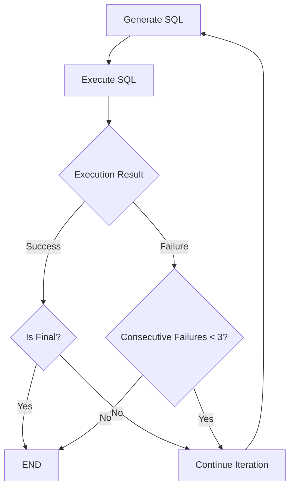

# Agent SQL Generation Logic Documentation

## Overview

The SQL Agent is a LangGraph-based iterative system that converts natural language queries into accurate SQL statements. It uses Anthropic's Claude 3.5 Sonnet model with a multi-step workflow that includes generation, execution, validation, and refinement.

## Architecture Components

### 1. **Agent State Management**
```python
class AgentState(TypedDict):
    messages: List[Dict[str, Any]]        # Chat message history
    current_sql_query: Optional[str]      # Currently generated SQL
    database_schema: str                  # DB schema for context
    user_nl_query: str                   # Original natural language query
    max_iterations: int                   # Maximum iterations allowed (default: 5)
    current_iteration: int                # Current iteration count
    active_connection_id: int             # Database connection ID
    current_notebook_id: int              # Notebook ID for SQL cell creation
    user_object: Any                      # User object
    final_sql: Optional[str]              # Final SQL when task is complete
    should_continue: bool                 # Whether to continue iterating
    error_message: Optional[str]          # Last error message if any
```

### 2. **Workflow Nodes**

#### A. **SQL Generation Node** (`sql_generation_node`)
- **Purpose**: Uses Claude 3.5 Sonnet to generate SQL based on natural language input
- **Input**: User query + database schema + conversation history
- **Process**:
  1. Builds system prompt with database-specific syntax rules
  2. Includes full schema information with column details
  3. Sends conversation history to maintain context
  4. Extracts SQL from Claude's response using regex pattern: `r'```sql\s*(.*?)\s*```'`
  5. Checks for duplicate SQL to prevent infinite loops
- **Output**: Generated SQL query

#### B. **SQL Execution Node** (`execute_sql_tool`)
- **Purpose**: Executes the generated SQL against the actual database
- **Process**:
  1. Gets database connection info from notebook
  2. Executes SQL using appropriate database handler (MySQL/PostgreSQL)
  3. Formats results for LLM feedback (row count, column info, sample data)
  4. Captures and formats any execution errors
- **Output**: Execution results or error messages

#### C. **Decision Router** (`decide_next_step`)
- **Purpose**: Determines the next step in the workflow
- **Logic Flow**:
  ```
  If max_iterations reached → END
  If unrecoverable error → END
  If final_sql exists and executed → END
  If consecutive failures >= 3 → END
  If last_role == 'assistant' and has SQL → execute_sql
  If last_role == 'tool_result' and failed → generate_sql (with increment)
  If last_role == 'tool_result' and succeeded → continue or END based on final flag
  ```

## Termination Logic

### **When Agent Stops Iterating:**

1. **Explicit Finalization**
   - Agent says "this is the final query" AND not on first iteration
   - Prevents premature termination on initial SQL generation

2. **Duplicate Detection**
   - Same SQL query generated twice in a row
   - Indicates agent is stuck in a loop

3. **Maximum Iterations**
   - Reaches configured limit (default: 5)
   - Prevents infinite loops

4. **Consecutive Failures**
   - 3+ consecutive SQL execution failures
   - Database connection/configuration errors

5. **Unrecoverable Errors**
   - Database connection lost
   - Notebook access denied
   - Schema retrieval failures

### **Current Termination Flow:**


## Database Schema Integration

### **Schema Retrieval Process:**
1. Get connection info from notebook
2. Call database-specific schema function:
   - `get_mysql_schema_info()` for MySQL
   - `get_postgresql_schema_info()` for PostgreSQL
3. Format schema using `format_schema_for_llm()`

### **Schema Information Included:**
- Schema/database names
- Table names (with schema qualification for PostgreSQL)
- Column names, types, and constraints
- Primary keys, unique constraints, indexes
- Nullable information
- Estimated row counts
- Database-specific syntax notes

### **PostgreSQL-Specific Enhancements:**
- Column quoting rules for special characters
- Schema-qualified table references
- Case sensitivity warnings
- Syntax examples for common patterns

## Agent Prompt Engineering

### **System Prompt Structure:**
```
1. Role definition (SQL generation assistant)
2. Database type and connection info
3. Complete schema information
4. User's natural language request
5. Current iteration number
6. Database-specific syntax guidelines
7. Workflow instructions
8. Termination conditions
9. Output format requirements
```

### **Database-Specific Instructions:**
- **PostgreSQL**: Emphasis on quoting, schema qualification, case sensitivity
- **MySQL**: Backtick usage, specific functions, AUTO_INCREMENT
- **Redshift**: Analytical functions, DISTKEY/SORTKEY optimization
- **Snowflake**: Time travel, VARIANT types, case insensitivity

## Current Strengths

### ✅ **What Works Well:**
1. **Iterative Refinement**: Agent learns from execution errors
2. **Schema Awareness**: Full database structure context
3. **Database-Specific Syntax**: Tailored prompts for each DB type
4. **Error Recovery**: Handles and learns from SQL failures
5. **Conversation Memory**: Maintains context across iterations
6. **Duplicate Prevention**: Avoids infinite loops
7. **Multi-Database Support**: MySQL, PostgreSQL, Redshift, Snowflake

## Areas for Improvement

### 🔧 **Technical Improvements:**

1. **Query Complexity Analysis**
   ```python
   # Could add query complexity scoring
   def assess_query_complexity(nl_query, schema):
       complexity_score = 0
       if "join" in nl_query.lower(): complexity_score += 2
       if "aggregate" in nl_query.lower(): complexity_score += 1
       if "window" in nl_query.lower(): complexity_score += 3
       return complexity_score
   ```

2. **Result Validation**
   ```python
   # Could add semantic result validation
   def validate_results(nl_query, sql_results):
       # Check if result count makes sense
       # Validate data types match expectations
       # Check for null-only results
       pass
   ```

3. **Query Optimization Suggestions**
   - Detect missing indexes from slow queries
   - Suggest query rewriting for performance
   - Warn about potential Cartesian products

4. **Enhanced Error Classification**
   ```python
   ERROR_TYPES = {
       'SYNTAX': ['syntax error', 'invalid syntax'],
       'PERMISSION': ['permission denied', 'access denied'],
       'SCHEMA': ['does not exist', 'unknown column'],
       'TIMEOUT': ['timeout', 'connection lost'],
       'DATA': ['division by zero', 'invalid date']
   }
   ```

### 🚀 **Feature Enhancements:**

1. **Query History Learning**
   - Store successful query patterns
   - Learn from user corrections
   - Suggest similar queries

2. **Performance Monitoring**
   - Track query execution times
   - Suggest query optimizations
   - Alert on slow queries

3. **Advanced Context Handling**
   - Reference previous cell results
   - Handle multi-step analysis workflows
   - Support for temporary tables/CTEs

4. **Quality Metrics**
   - Success rate tracking
   - Average iterations per query
   - Error pattern analysis

### 📊 **Monitoring & Analytics:**

1. **Agent Performance Metrics**
   ```python
   # Could track these metrics
   metrics = {
       'success_rate': 0.85,
       'avg_iterations': 1.3,
       'common_errors': ['column_not_found', 'syntax_error'],
       'db_type_performance': {'postgresql': 0.90, 'mysql': 0.82}
   }
   ```

2. **User Experience Improvements**
   - Show query confidence scores
   - Explain query reasoning
   - Suggest alternative approaches

## Configuration Options

### **Current Settings:**
```python
MAX_ITERATIONS = 5          # Maximum refinement cycles
QUERY_TIMEOUT = 30          # SQL execution timeout (seconds)
CONNECTION_TIMEOUT = 10     # Database connection timeout
MAX_RESULT_ROWS = 1000      # Limit for result display
```

### **Tunable Parameters:**
- Iteration limits based on query complexity
- Timeout adjustments per database type
- Schema information depth
- Result sampling size for LLM feedback

## Error Handling Strategy

### **Current Approach:**
1. **Graceful Degradation**: Always try to provide useful feedback
2. **Specific Error Messages**: Parse database errors for user context
3. **Automatic Retry**: Re-attempt with refined prompts
4. **Fallback Options**: Suggest manual approaches when automated fails

### **Error Recovery Patterns:**
```python
# Common error → recovery action mapping
ERROR_RECOVERY = {
    'column_not_found': 'Check schema and suggest similar columns',
    'syntax_error': 'Review database-specific syntax rules',
    'permission_denied': 'Suggest simpler query or different tables',
    'timeout': 'Recommend query optimization or data filtering'
}
```

## Future Architecture Considerations

### **Potential Enhancements:**
1. **RAG Integration**: Vector search over schema documentation
2. **Multi-Agent Architecture**: Separate agents for different query types
3. **Caching Layer**: Store and reuse successful query patterns
4. **Streaming Results**: Handle large result sets efficiently
5. **Query Explanation**: Generate human-readable query descriptions

This agent represents a sophisticated approach to natural language-to-SQL conversion with strong error recovery and database-specific optimization capabilities. 